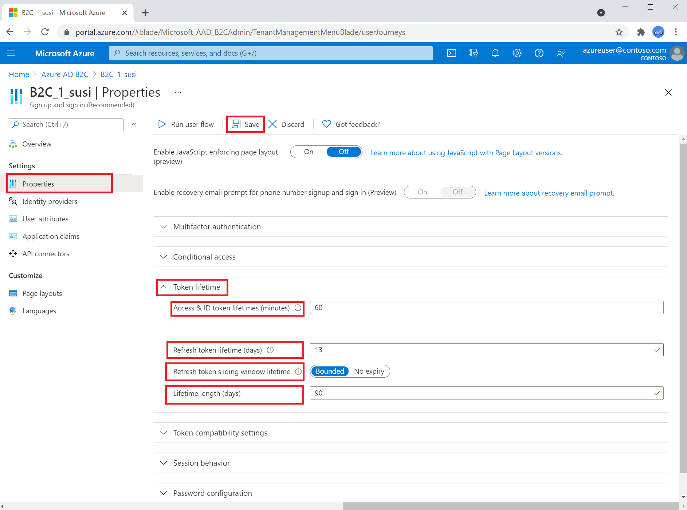

# 🧠 Visão Geral: Inteligência Artificial

<div align="center">


</div>

## 📋 O que é Inteligência Artificial?

**IA é a capacidade da máquina de aprender padrões e fazer suas predições.** Combina as ciências da computação e o conjunto de dados robustos para a resolução de problemas.

> 💡 **Definição Simplificada**: IA é como ensinar um computador a "pensar" e tomar decisões baseadas em exemplos e dados.

## 🏗️ Modelos de IA

### **Modelos de Linguagem Grandes (LLMs)**

**Definição**: São um tipo especializado de modelo de machine learning que alimentam os sistemas de IA. Podem ser usados para executar:

✅ **Resumir um texto**  
✅ **Determinar sentimento**  
✅ **Comparar várias fontes de texto quanto a similaridade semântica**  
✅ **Geração de nova linguagem natural**

**Exemplos de LLMs**:
- **GPT (Generative Pre-trained Transformer)** - OpenAI
- **BERT (Bidirectional Encoder Representations from Transformers)** - Google
- **T5 (Text-To-Text Transfer Transformer)** - Google
- **RoBERTa** - Facebook/Meta

---

### **Modelo Transformer** 🔄

**O modelo de IA transformador** é uma arquitetura de rede neural que revolucionou o campo da inteligência artificial, especialmente no processamento de linguagem natural (PLN).

#### **Arquitetura Principal**

A arquitetura de um modelo transformador é tipicamente composta por duas partes principais:

##### **1. Codificador (Encoder)** 📥

**Função**: Processar a sequência de entrada (por exemplo, uma frase em português) e construir uma representação rica em contexto.

**Componentes**:
- **Pilha de camadas idênticas**
- **Mecanismo de auto-atenção (self-attention)**
- **Rede neural feed-forward**

**Como funciona**: A auto-atenção permite que o codificador relacione cada palavra da entrada com todas as outras, criando uma compreensão contextualizada da frase.

##### **2. Decodificador (Decoder)** 📤

**Função**: Utilizar a representação gerada pelo codificador para produzir a sequência de saída (por exemplo, a tradução da frase em inglês).

**Componentes**:
- **Camadas de auto-atenção**
- **Redes neurais feed-forward**
- **Mecanismo de atenção** (foca nas partes mais relevantes do codificador)

**Como funciona**: O decodificador emprega um mecanismo de atenção que se concentra nas partes mais relevantes da representação do codificador para gerar a próxima palavra na sequência de saída.

---

## 🔄 O Processo de Tokenização

*A Inteligência Artificial, especialmente em plataformas de nuvem como o Microsoft Azure, transformou a maneira como analisamos texto. A identificação de sentimento, uma tarefa comum de Processamento de Linguagem Natural (PLN), permite que máquinas compreendam e classifiquem as emoções e opiniões expressas em dados de texto.*

### **O que é Tokenização?**

**Definição**: Antes que um modelo de IA possa "entender" um texto, ele precisa ser dividido em pedaços menores e compreensíveis chamados **tokens**.

> ⚠️ **Abordagem Ingênua**: Simplesmente dividir o texto por espaços é ineficaz para a maioria das aplicações de PLN.

### **Processo de Tokenização Avançada**

#### **1. Divisão em Tokens** ✂️

Cada sentença é dividida em tokens. Os modelos de linguagem do Azure não se limitam a palavras inteiras.

**Algoritmos Utilizados**:
- **Byte-Pair Encoding (BPE)**
- **WordPiece**

**Vantagem**: Permite que o modelo lide eficientemente com palavras raras ou desconhecidas, decompondo-as em unidades menores e mais familiares.

#### **2. Exemplo Prático** 📝

**Texto Original**: "A comida estava ótima, mas o serviço demorou."

**Processo de Tokenização**:
- **Palavra simples**: "ótima" → token único
- **Palavra complexa**: "excelentíssimo" → ["excelent", "##íssimo"]

**Tokens Resultantes** (simplificado):
```
["A", "comida", "estava", "ótima", ",", "mas", "o", "serviço", "demorou", "."]
```

### **Visualização do Processo**



---

## 🎯 Aplicações Práticas

### **Análise de Sentimento** 😊😐😢

**Como funciona**:
1. **Entrada**: Texto do usuário
2. **Tokenização**: Divisão em tokens
3. **Processamento**: Análise pelo modelo
4. **Saída**: Classificação de sentimento (positivo, neutro, negativo)

**Exemplo**:
- **Entrada**: "Este produto é incrível!"
- **Saída**: Sentimento positivo (0.95)

### **Tradução Automática** 🌐

**Como funciona**:
1. **Entrada**: Texto em idioma A
2. **Codificação**: Processamento pelo encoder
3. **Decodificação**: Geração do texto em idioma B
4. **Saída**: Tradução completa

### **Geração de Texto** ✍️

**Como funciona**:
1. **Entrada**: Prompt inicial
2. **Processamento**: Geração token por token
3. **Saída**: Texto completo gerado

---

## 🛠️ Serviços Azure para IA

### **Azure Cognitive Services**
- **Text Analytics** - Análise de sentimento e extração de entidades
- **Language Understanding (LUIS)** - Processamento de linguagem natural
- **Translator** - Tradução automática
- **Speech Services** - Reconhecimento e síntese de fala

### **Azure Machine Learning**
- **AutoML** - Treinamento automático de modelos
- **MLOps** - Gerenciamento do ciclo de vida de ML
- **Interpretability** - Explicabilidade de modelos

### **Azure OpenAI Service**
- **GPT Models** - Modelos de linguagem avançados
- **Embeddings** - Representações vetoriais de texto
- **Fine-tuning** - Personalização de modelos

---

## 📚 Conceitos Avançados

### **Attention Mechanism** 👁️

**Definição**: Permite que o modelo "preste atenção" em diferentes partes da entrada ao processar cada token.

**Vantagens**:
- Melhor compreensão de contexto
- Processamento paralelo
- Captura de dependências de longo alcance

### **Transfer Learning** 🔄

**Definição**: Aproveitar conhecimento de um modelo pré-treinado para uma tarefa específica.

**Benefícios**:
- Menos dados necessários
- Treinamento mais rápido
- Melhor performance

---

<div align="center">

*"A IA não substitui a inteligência humana, mas a amplifica."*

</div>
